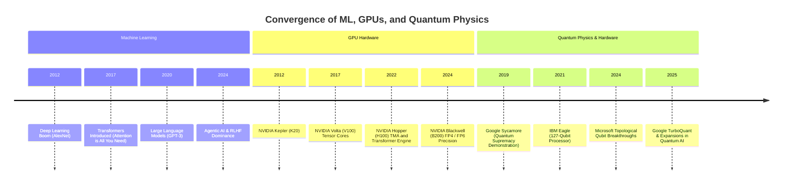

# Convergence Timeline

The path to modern Quantum AI is a convergence of three parallel tracks: Machine Learning software, GPU Hardware acceleration, and Quantum Physics breakthroughs.

```mermaid
timeline
    title Convergence of ML, GPUs, and Quantum Physics
    section Machine Learning
        2012 : Deep Learning Boom (AlexNet)
        2017 : Transformers Introduced (Attention is All You Need)
        2020 : Large Language Models (GPT-3)
        2024 : Agentic AI & RLHF Dominance
    section GPU Hardware
        2012 : NVIDIA Kepler (K20)
        2017 : NVIDIA Volta (V100) Tensor Cores
        2022 : NVIDIA Hopper (H100) TMA and Transformer Engine
        2024 : NVIDIA Blackwell (B200) FP4 / FP6 Precision
    section Quantum Physics & Hardware
        2019 : Google Sycamore (Quantum Supremacy Demonstration)
        2021 : IBM Eagle (127-Qubit Processor)
        2024 : Microsoft Topological Qubit Breakthroughs
        2025 : Google TurboQuant & Expansions in Quantum AI
```
